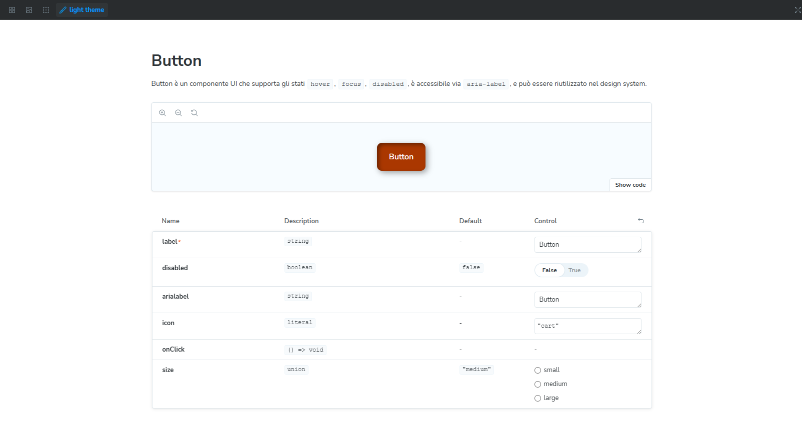
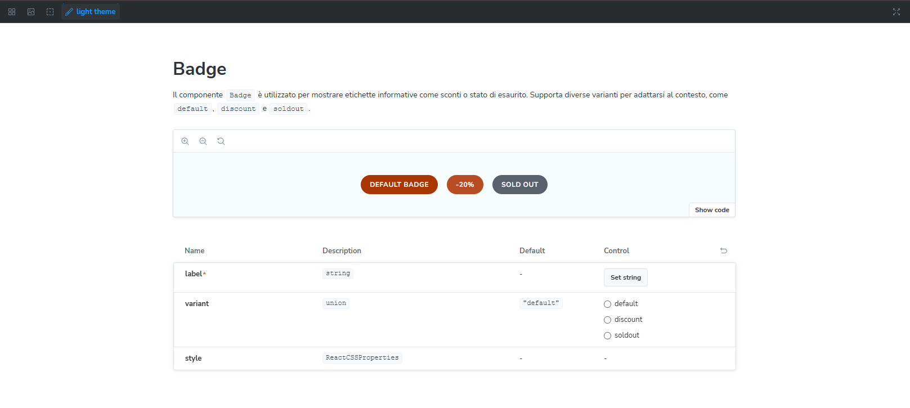
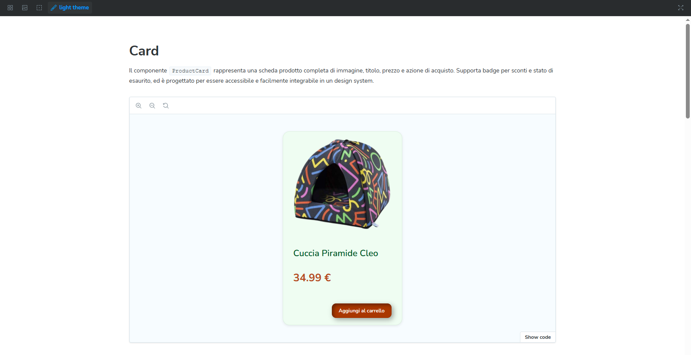
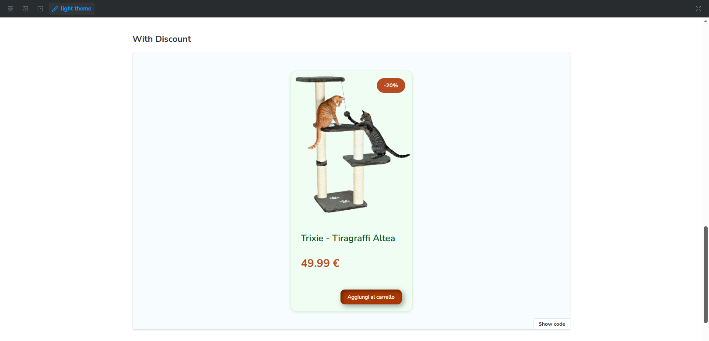
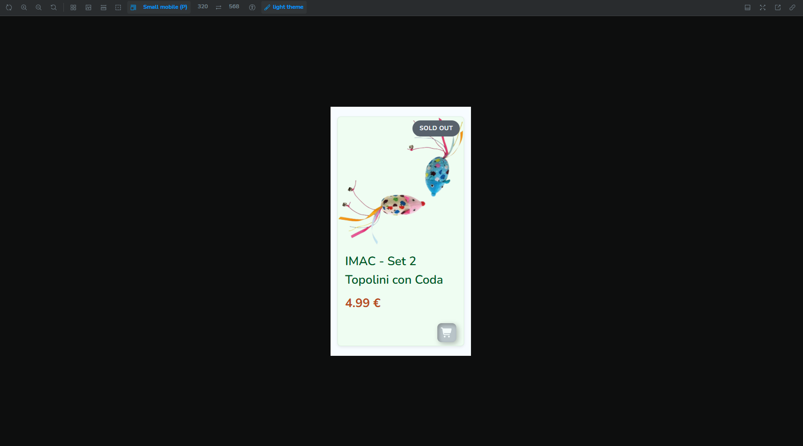

# 🐾 Webdesign Card Component

Il seguente componente di design prende ispirazione per un ipotetico e-commerce che vende prodotti per animali, in particolare per gatti. Questa repository contiene tre **componenti UI personalizzati** di cui fanno parte il Bottone, i Badge e la Card.

---

## 🚀 Tecnologie utilizzate


---

## 📦 Contenuto

- ✅ Componenti `Card` , `Button` , `Badge` riutilizzabili
- 🎨 Palette di colori custom basata su variabili CSS (`--gray`, `--saige`, `--terracotta`)
- 🧩 Varianti/stati: `default`, `hover`, `focus`, `disabled`, `sold out`
- 🌙 Tema chiaro/scuro
- 💬 Tono di voce e testo coerenti (UX writing)
- 👓 Color Contrast Checker (WCAG AAA)
- ⚙️ Documentazione interattiva via Storybook

## 🎨 Componenti disponibili

### 1. **Card**

- **Default**: card standard con immagine, titolo prodotto, prezzo e bottone "Aggiungi al carrello"
- **Con badge di sconto**: mostra un’etichetta sconto (`-20%`)
- **Sold Out**: con badge _Sold Out_ e prodotto non acquistabile

### 2. **Button**

Con supporto agli stati:

- **Default**
- **Hover**
- **Focus**
- **Disabled**

### 3. **Badge**

- Etichetta personalizzabile
- Varianti: `default`, `discount`, `sold out`

---

## 🎨 Palette di colori e il loro significato

La palette è costruita con tre famiglie principali: **Grigi**, **Verde Salvia** e **Terracotta**, più variabili per il supporto **light/dark mode**.

### ⚪ Grigi

- **Significato**: neutralità, equilibrio, leggibilità
- **Ruolo in UI**: forniscono contrasto con colori primari e CTA, distinguono gerarchie di testo, gestiscono stati disabled

### 🌿 Verde Salvia (colore primario / sfondo card)

- **Significato**: calma, naturalezza, accoglienza
- **Ruolo in UI**: definisce lo sfondo delle card, crea un’area rilassante e leggibile per il contenuto, supporta testi principali in light/dark mode
  - Comunica **tranquillità e comfort**, perfetto per un brand legato agli animali

### 🟠 Terracotta (colore CTA / interazione)

- **Significato**: energia, urgenza, azione
- **Ruolo in UI**: evidenzia elementi interattivi come bottoni e badge, guida l’utente verso le azioni principali, comunica stati hover e focus

### 🌗 Light/Dark Mode

- **Significato**: adattabilità, leggibilità, inclusività
- **Ruolo in UI**: mantiene contrasto e leggibilità in modalità chiara o scura, garantisce accessibilità secondo WCAG

---

## 📱 Responsive Design

I componenti sono progettati per adattarsi a diversi schermi, dai desktop ai dispositivi mobile, mantenendo leggibilità e usabilità.

### Card

- `.card-container`
  - **Desktop**: max-width 280px
  - **Tablet (≤834px)**: titolo più grande (`--font-size-h4`), prezzo adeguato (`--font-size-h5`)
  - **Mobile (≤480px)**: max-width 100%, font ridotti (`--font-size-sm`), testo leggibile su schermi piccoli

### Bottone (`.orange-btn`)

- **Dimensioni adattive**: small, medium, large
- **Tablet (≤834px)**: font e padding ridotti, bottone centrato
- **Mobile (≤320px)**: font ancora più piccolo, padding ridotto, testo nascosto (`.button-text`), icona visibile solo in mobile

### Badge (`.badge`)

- **Tablet e Mobile (≤480px)**: font più piccolo, padding ridotto per adattarsi alle card compatte

---

## 📖 Documentazione

Tutti i componenti sono documentati con **Storybook**, comprensivi di:

- Varianti di utilizzo
- Palette colori
- Tipografia
- Controlli per le props
- Accessibilità

Per avviare Storybook:

```bash
npm install
npm run storybook
```

## 📸 Screenshot

### BUTTON



### BADGE



### DEFAULT CARD



### DISCOUNT CARD



### RESPONSIVE MOBILE + SOLD OUT CARD


